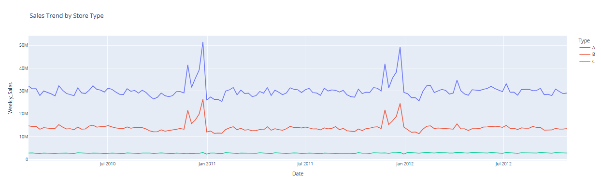
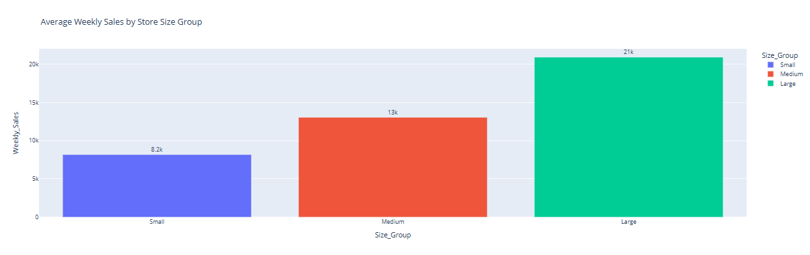
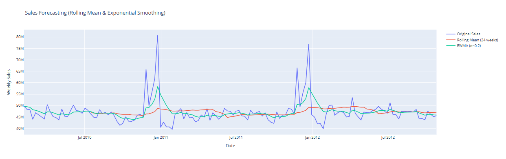

# 🛒 Walmart Sales Forecasting  

A data analysis project focused on understanding **Walmart’s weekly sales performance** and building a **simple forecast** using moving averages.  

---

## 🎯 Project Objective  
The goal of this notebook is to:  
- Explore and analyze sales patterns over time.  
- Identify performance trends by store size.  
- Build a basic time-series model (Rolling Mean) to estimate future sales.  

---

## 📊 Project Workflow  

### 1. Data Preparation  
- Cleaned and formatted raw data.  
- Converted date columns for time-based analysis.  

### 2. Exploratory Data Analysis (EDA)  
- Investigated overall weekly sales distribution.  
- Compared sales by store size group.  
- Detected seasonal and temporal trends.  

### 3. Visualization  
- Created interactive **line and area charts** using Plotly.  
- Visualized sales trends and store size comparisons.  

### 4. Forecasting  
- Applied a **20-week Moving Average** to smooth and predict future trends.  
- Illustrated simple forecasting results visually.  

---

## 🧠 Tools & Libraries  
- **Python**  
- **Pandas**, **NumPy**  
- **Plotly**, **Matplotlib**, **Seaborn**  

---

## 📁 Files in Repository  
| File | Description |
|------|--------------|
| `Task_Elevvo_Walmart_Sales.ipynb` | Main Jupyter notebook with full analysis and visualization. |
| `test.csv` | Supplementary dataset (not used in final analysis). |

---

## 📈 Key Insights  
- Weekly sales fluctuate seasonally but show identifiable growth trends.  
- Larger stores generally generate higher weekly sales.  
- Moving average helps highlight long-term performance and predict short-term changes.  

---

## 📸 Sample Visualizations  

### Sales Trend by Store Type  

### Average Weekly Sales by Store Size Group  

### Sales Forecasting (Rolling Mean & Exponential Smoothing)

---

## 🌐 Explore the Notebook  
You can open and explore the project directly in **Google Colab**:  
[🔗 Open in Colab](https://colab.research.google.com/drive/1GX1GKe2SJZrUlgmVfhINPwcjVjXTCscY?usp=sharing)

---

## 👤 Author  
**Mohamed Amr**  
[LinkedIn Profile](https://www.linkedin.com/in/mohamed-amr009/)  
